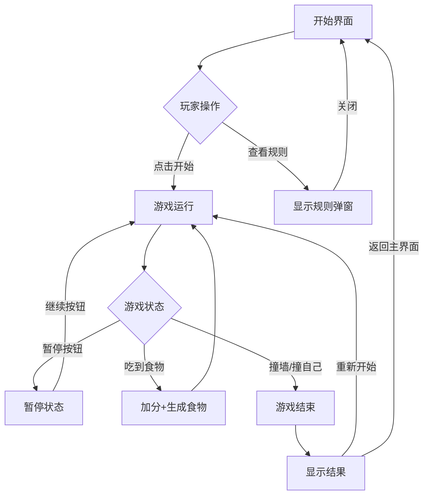

# 贪吃蛇游戏产品需求文档

## 1. 产品概述

一款融合现代美学与复古街机风格的网页版贪吃蛇游戏，为玩家提供流畅、沉浸式的游戏体验。游戏采用霓虹光效与深色背景的视觉设计，支持键盘和触摸双重控制，通过渐进式难度和实时反馈机制让玩家获得成就感与挑战乐趣。

**核心价值：**
- 简约而不简单的经典玩法
- 流畅的60fps动画体验
- 响应式设计适配所有设备
- 本地最高分排行榜激励玩家

**目标用户：**
- 休闲游戏爱好者
- 寻找快速娱乐的用户
- 竞技类游戏玩家

## 2. 核心功能模块

### 2.1 用户角色

| 角色 | 说明 | 核心权限 |
|------|------|----------|
| 玩家 | 游戏参与者 | 开始游戏、控制蛇移动、查看分数、挑战最高分 |

### 2.2 功能模块划分

#### 2.2.1 游戏主界面
- **游戏画布**：HTML5 Canvas渲染的游戏区域
- **分数面板**：实时显示当前分数、等级、最高分
- **控制面板**：开始、暂停、重新开始按钮
- **信息展示**：游戏规则说明、操作指南

#### 2.2.2 蛇身移动控制系统
- **键盘控制**：支持方向键（↑↓←→）控制移动方向
- **触摸控制**：移动端屏幕触摸滑动方向控制
- **方向锁定**：防止180度反向移动
- **移动逻辑**：网格化移动，固定时间间隔

#### 2.2.3 食物系统
- **随机生成**：在空白格子随机生成食物
- **碰撞检测**：蛇头与食物坐标重叠判定为吃到
- **视觉效果**：食物带有闪烁或发光动画
- **反馈机制**：吃到食物时的视觉和音效反馈

#### 2.2.4 得分与等级系统
- **得分规则**：每吃一个食物得10分
- **等级提升**：每50分提升一个等级（1-10级）
- **速度递增**：等级越高，蛇移动速度越快
- **难度梯度**：网格大小固定，速度随等级提升

#### 2.2.5 游戏状态管理
- **开始状态**：显示开始界面，等待玩家操作
- **运行状态**：游戏进行中
- **暂停状态**：游戏暂停，保留当前状态
- **结束状态**：显示最终分数和重新开始选项

#### 2.2.6 本地存储
- **最高分记录**：使用localStorage保存历史最高分
- **数据持久化**：刷新页面后最高分不丢失
- **首次玩家**：首次游戏时最高分为0

### 2.3 页面设计详情

#### 2.3.1 游戏主界面
| 模块名称 | 功能描述 | UI元素 |
|---------|---------|--------|
| 游戏画布 | 20x20网格的Canvas游戏区域 | 深色背景 + 网格线 + 霓虹边框 |
| 分数显示 | 实时分数、等级、最高分 | 大字体数字 + 标签文字 |
| 控制按钮 | 开始/暂停/重新开始 | 发光按钮 + hover效果 |
| 操作指南 | 键盘和触摸操作说明 | 图标 + 简洁文字 |
| 游戏规则 | 游戏目标和结束条件 | 简洁列表形式 |

## 3. 核心交互流程

### 3.1 游戏主流程

```
玩家进入游戏 → 显示开始界面 → 点击开始 → 游戏运行中
↓                                          ↓
↓                                    蛇吃到食物？
↓                                    是 → 加分 + 生成新食物
↓                                          ↓
↓                                    撞墙或撞自己？
↓                                    是 → 游戏结束
↓                                          ↓
← ← ← ← ← ← ← ← ← ← ← ← ← ← ← ← ← ← ← ← ← ← ←
↓
显示最终分数 → 更新最高分（如需要） → 选择重新开始或退出
```

### 3.2 用户交互流程图



## 4. 用户界面设计

### 4.1 设计风格：霓虹街机风

**视觉定位：**
- 深邃的深蓝色/黑色背景
- 霓虹光效的边框和元素
- 像素化与现代感的融合
- 动态的光晕和阴影效果

**色彩方案：**
- 主色：`#00ff88` (霓虹绿 - 蛇的颜色)
- 强调色：`#ff0066` (霓虹粉 - 食物颜色)
- 辅助色：`#00ccff` (霓虹蓝 - UI元素)
- 背景色：`#0a0a1a` (深空蓝)
- 文字色：`#ffffff` (白色)
- 边框色：`#333366` (深蓝边框)

**字体选择：**
- 标题字体：`'Press Start 2P'` (像素风格)
- 数字字体：`'Orbitron'` (科技感)
- 说明字体：`'Roboto'` (清晰易读)

**按钮风格：**
- 圆角矩形，带发光边框
- Hover时有光晕扩散效果
- Active时有按压下沉效果

**布局风格：**
- 居中式布局
- 卡片式模块设计
- 充足的留白空间
- 明确的视觉层次

### 4.2 响应式设计

**桌面端（≥1024px）：**
- 游戏画布：500x500px
- 分数面板在画布上方
- 控制按钮在画布下方
- 规则说明在侧边

**平板端（768px-1023px）：**
- 游戏画布：450x450px
- 分数面板在画布上方
- 控制按钮在画布下方
- 规则说明在下方折叠展开

**移动端（<768px）：**
- 游戏画布：90vw（最大360px）
- 分数面板紧凑排列
- 控制按钮适合触摸
- 触摸滑动控制蛇方向
- 规则说明可展开/收起

### 4.3 动画效果

**蛇移动动画：**
- 网格化移动，每200-80ms移动一格（根据等级）
- 平滑的过渡效果（可选）

**食物动画：**
- 持续闪烁效果（opacity变化）
- 被吃时的爆炸/消失动画

**分数动画：**
- 加分时数字放大效果
- 等级提升时的庆祝动画

**按钮动画：**
- Hover时的光晕扩散
- 点击时的按压反馈
- 状态切换时的过渡效果

**游戏结束动画：**
- 蛇消失动画
- 结果展示的淡入效果
- 最高分更新的特殊效果

## 5. 技术约束

### 5.1 性能要求
- 游戏帧率：≥30fps（目标60fps）
- 响应时间：输入延迟<50ms
- 加载时间：首次加载<2秒

### 5.2 浏览器兼容性
- Chrome 90+
- Firefox 88+
- Safari 14+
- Edge 90+

### 5.3 可访问性
- 键盘完全可操作
- 触摸友好的按钮尺寸（最小44x44px）
- 清晰的视觉反馈
- 适当的颜色对比度

## 6. 数据管理

### 6.1 本地存储结构
```javascript
// localStorage key: 'snakeGameHighScore'
{
  highScore: number,
  lastPlayed: string (ISO日期)
}
```

### 6.2 游戏状态管理
```javascript
{
  snake: [{x, y}, ...],  // 蛇身坐标数组
  food: {x, y},          // 食物坐标
  direction: 'up'|'down'|'left'|'right',  // 当前方向
  score: number,        // 当前分数
  level: number,        // 当前等级 (1-10)
  gameState: 'idle'|'playing'|'paused'|'ended',  // 游戏状态
  speed: number         // 当前速度 (ms/格)
}
```
