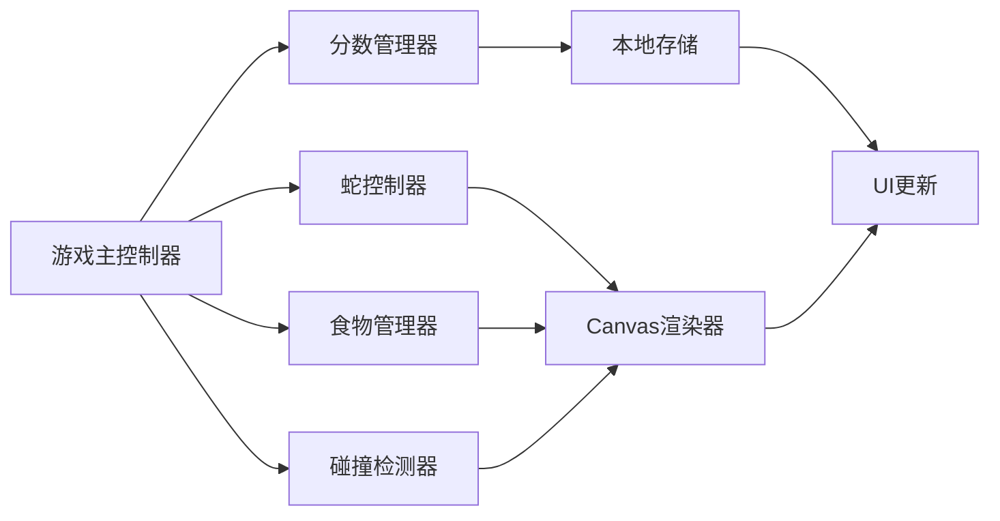
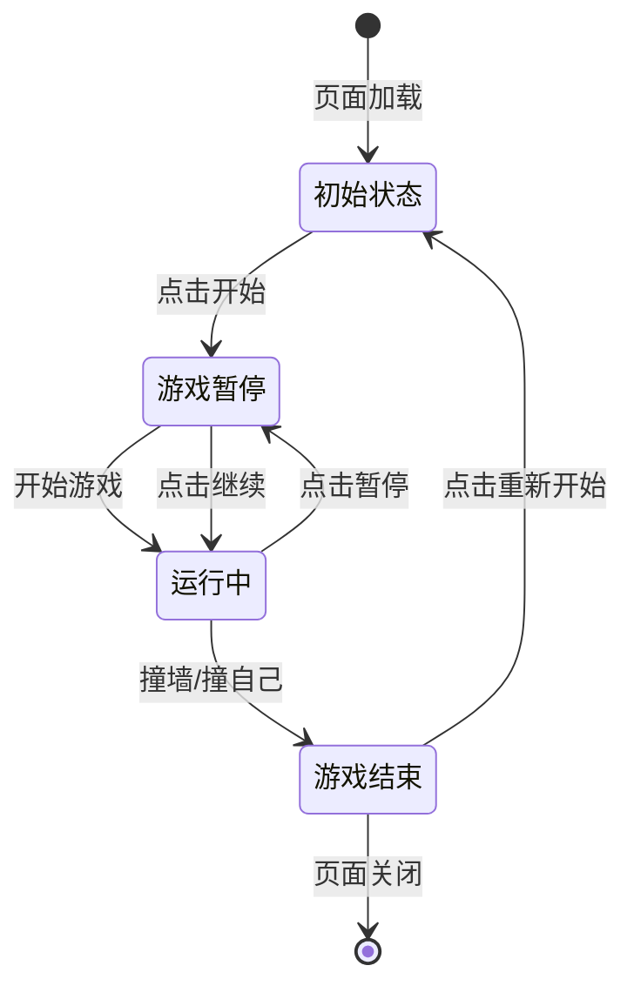

# 贪吃蛇游戏技术架构文档

## 1. 架构设计

### 1.1 整体架构

```
┌─────────────────────────────────────────┐
│           用户界面层 (UI Layer)          │
│  ┌─────────┐ ┌─────────┐ ┌───────────┐  │
│  │游戏画布 │ │分数面板 │ │控制按钮组 │  │
│  └─────────┘ └─────────┘ └───────────┘  │
├─────────────────────────────────────────┤
│         游戏逻辑层 (Game Logic)          │
│  ┌──────────┐ ┌──────────┐ ┌─────────┐  │
│  │蛇移动控制│ │碰撞检测  │ │分数管理 │  │
│  └──────────┘ └──────────┘ └─────────┘  │
├─────────────────────────────────────────┤
│         状态管理层 (State Management)    │
│  ┌────────────┐ ┌────────────────────┐   │
│  │游戏状态机  │ │本地存储管理器      │   │
│  └────────────┘ └────────────────────┘   │
├─────────────────────────────────────────┤
│         渲染层 (Rendering Layer)         │
│  ┌──────────────────────────────────┐    │
│  │     Canvas 2D Context 渲染       │    │
│  └──────────────────────────────────┘    │
└─────────────────────────────────────────┘
```

### 1.2 模块依赖关系



## 2. 技术选型

### 2.1 前端技术栈

* **渲染技术**：HTML5 Canvas 2D

* **原生语言**：JavaScript (ES6+)

* **样式技术**：CSS3 (Flexbox, Grid, CSS Variables, Animations)

* **构建工具**：无（单文件HTML，便于部署和运行）

* **字体资源**：Google Fonts CDN

### 2.2 技术优势

* **轻量级**：无需构建工具，直接在浏览器运行

* **高性能**：Canvas 2D渲染效率高

* **兼容性**：所有现代浏览器支持

* **可维护**：模块化代码结构清晰

### 2.3 外部依赖

* Google Fonts：Press Start 2P, Orbitron, Roboto

* 无其他外部JavaScript库

## 3. 文件结构

```
plan_demo/
└── index.html          # 游戏主文件（包含所有代码）
    ├── <style>         # 内嵌CSS样式
    ├── <canvas>        # 游戏画布
    ├── <script>        # 游戏逻辑
    │   ├── GameController      # 游戏主控制器
    │   ├── Snake               # 蛇类
    │   ├── Food                # 食物类
    │   ├── CollisionDetector   # 碰撞检测
    │   ├── ScoreManager        # 分数管理
    │   ├── StorageManager       # 本地存储管理
    │   ├── InputHandler        # 输入处理
    │   └── UIRenderer          # UI渲染
    └── 响应式布局容器
```

## 4. 核心类设计

### 4.1 GameController（游戏主控制器）

**职责：**

* 管理游戏生命周期

* 协调各模块工作

* 控制游戏循环

* 处理游戏状态切换

**关键方法：**

```javascript
class GameController {
  constructor()
  init()
  start()
  pause()
  resume()
  restart()
  gameOver()
  update()
  render()
  gameLoop()
}
```

### 4.2 Snake（蛇类）

**职责：**

* 管理蛇身数据

* 控制移动方向

* 处理蛇身增长

**关键方法：**

```javascript
class Snake {
  constructor()
  move()
  grow()
  setDirection(dir)
  getHead()
  checkSelfCollision()
  render(ctx, gridSize)
}
```

### 4.3 Food（食物类）

**职责：**

* 生成食物位置

* 碰撞检测

* 视觉效果

**关键方法：**

```javascript
class Food {
  constructor()
  generate(snakeBody)
  checkCollision(head)
  render(ctx, gridSize)
}
```

### 4.4 CollisionDetector（碰撞检测）

**职责：**

* 检测墙壁碰撞

* 检测自身碰撞

* 检测食物碰撞

**关键方法：**

```javascript
class CollisionDetector {
  checkWallCollision(head, gridSize)
  checkSelfCollision(head, snakeBody)
  checkFoodCollision(head, food)
}
```

### 4.5 ScoreManager（分数管理器）

**职责：**

* 计算分数

* 管理等级

* 计算速度

* 更新UI

**关键方法：**

```javascript
class ScoreManager {
  addScore(points)
  increaseLevel()
  getSpeed()
  reset()
  updateUI()
}
```

### 4.6 StorageManager（本地存储管理）

**职责：**

* 保存最高分

* 读取最高分

* 数据持久化

**关键方法：**

```javascript
class StorageManager {
  saveHighScore(score)
  loadHighScore()
  updateHighScore(score)
}
```

### 4.7 InputHandler（输入处理）

**职责：**

* 监听键盘事件

* 监听触摸事件

* 方向输入验证

**关键方法：**

```javascript
class InputHandler {
  init()
  handleKeyDown(e)
  handleTouch(e)
  setDirectionCallback(callback)
}
```

### 4.8 UIRenderer（UI渲染）

**职责：**

* 更新分数显示

* 更新等级显示

* 控制按钮状态

* 显示游戏信息

**关键方法：**

```javascript
class UIRenderer {
  updateScore(score)
  updateLevel(level)
  updateHighScore(highScore)
  showGameOver(finalScore, isNewHighScore)
  showMessage(msg)
}
```

## 5. 游戏配置参数

```javascript
const CONFIG = {
  GRID_SIZE: 20,              // 网格大小 20x20
  CELL_SIZE: 25,               // 每格像素大小
  INITIAL_SPEED: 200,          // 初始速度（ms/格）
  MIN_SPEED: 80,               // 最小速度（最高等级）
  SCORE_PER_FOOD: 10,          // 每个食物得分
  POINTS_PER_LEVEL: 50,        // 每50分升一级
  MAX_LEVEL: 10,               // 最高等级
  STORAGE_KEY: 'snakeGameHighScore'  // localStorage键名
}
```

## 6. 游戏状态机



## 7. 数据流

### 7.1 游戏循环数据流

```
1. 输入处理 → InputHandler获取方向
        ↓
2. 状态更新 → Snake.move()
        ↓
3. 碰撞检测 → CollisionDetector检测
        ↓
4. 分数更新 → ScoreManager计算
        ↓
5. 渲染绘制 → Canvas绘制画面
        ↓
6. UI更新 → UIRenderer更新分数显示
        ↓
7. 循环 → requestAnimationFrame
```

### 7.2 事件流

```
用户输入(键盘/触摸)
        ↓
InputHandler解析输入
        ↓
验证方向合法性
        ↓
更新Snake.direction
        ↓
触发下一次移动
```

## 8. 性能优化策略

### 8.1 渲染优化

* 使用requestAnimationFrame实现流畅动画

* 只在状态变化时重绘

* 避免不必要的DOM操作

### 8.2 游戏逻辑优化

* 固定时间步长更新游戏状态

* 高效的碰撞检测算法

* 最小化对象创建和垃圾回收

### 8.3 响应式优化

* Canvas尺寸动态调整

* CSS媒体查询处理布局

* 触摸事件优化

## 9. 浏览器兼容性保证

### 9.1 Canvas支持

```javascript
// 检测Canvas支持
const canvas = document.createElement('canvas');
const ctx = canvas.getContext('2d');
if (!ctx) {
  alert('您的浏览器不支持Canvas，请升级浏览器');
}
```

### 9.2 ES6特性支持

* 使用Babel转换（如需支持旧浏览器）

* 或限制使用ES5兼容语法

### 9.3 localStorage支持

```javascript
// 检测localStorage支持
try {
  localStorage.setItem('test', 'test');
  localStorage.removeItem('test');
} catch (e) {
  console.warn('localStorage不可用，最高分将不会保存');
}
```

## 10. 部署方案

* **单文件部署**：所有代码整合到index.html

* **CDN加速**：使用CDN托管Google Fonts

* **无需后端**：纯前端应用

* **跨域友好**：无CORS问题

## 11. 测试策略

### 11.1 功能测试

* 游戏开始/暂停/重新开始

* 蛇移动方向控制

* 食物碰撞检测

* 分数计算

* 等级提升

* 最高分保存和读取

### 11.2 兼容性测试

* Chrome、Firefox、Safari、Edge

* 桌面端和移动端

* 不同屏幕尺寸

### 11.3 性能测试

* 帧率稳定性

* 响应延迟

* 内存占用

